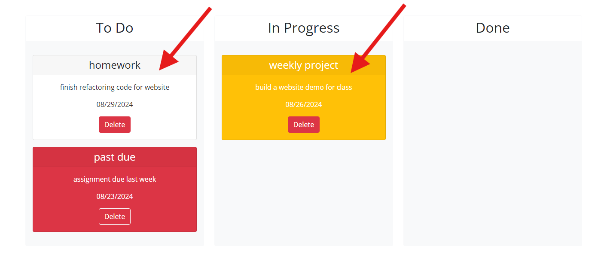

# Kanban Website

## Description

- As a student
- I want to have a kanban website
- So that I can easily see what tasks I need to work on next

This project involves a lot of problem solving using jquery and bootstrap APIs. It uses cards and the draggable and droppable classes, which give the website great functionality.

## Installation

Navigate the URL https://mcellis1.github.io/special-octo-rotary-phone/ to see the functional webiste.

## Usage

Click on the "Add Task" button to open the modal form.

The modal for will prompt you to fill out 3 fields, the name of the task itself, the due date, and a description of the work to be done.

Once the submit button is clicked, the task will be added to the "To Do" column of the kanban board. If the due date is in the future, the card will be white, if the due date is today, the card will be yellow, and if the due date is in the past, then the card will be red.

The cards can be dragged between categories from "To Do" to "In Progress" to show that the task has been started.

Once completed, the task can be dragged to the "Done" column. All tasks in the done column are white, regardless of due date.

To delete a task from the kanban board, click the red "Delete" button.

## Credits

The started code for this project came from the repository musical-happiness on github from user mcewball13 https://github.com/coding-boot-camp/musical-happiness

## MIT License

Permission is hereby granted, free of charge, to any person obtaining a copy
of this software and associated documentation files (the "Software"), to deal
in the Software without restriction, including without limitation the rights
to use, copy, modify, merge, publish, distribute, sublicense, and/or sell
copies of the Software, and to permit persons to whom the Software is
furnished to do so, subject to the following conditions:

THE SOFTWARE IS PROVIDED "AS IS", WITHOUT WARRANTY OF ANY KIND, EXPRESS OR
IMPLIED, INCLUDING BUT NOT LIMITED TO THE WARRANTIES OF MERCHANTABILITY,
FITNESS FOR A PARTICULAR PURPOSE AND NONINFRINGEMENT. IN NO EVENT SHALL THE
AUTHORS OR COPYRIGHT HOLDERS BE LIABLE FOR ANY CLAIM, DAMAGES OR OTHER
LIABILITY, WHETHER IN AN ACTION OF CONTRACT, TORT OR OTHERWISE, ARISING FROM,
OUT OF OR IN CONNECTION WITH THE SOFTWARE OR THE USE OR OTHER DEALINGS IN THE
SOFTWARE.
